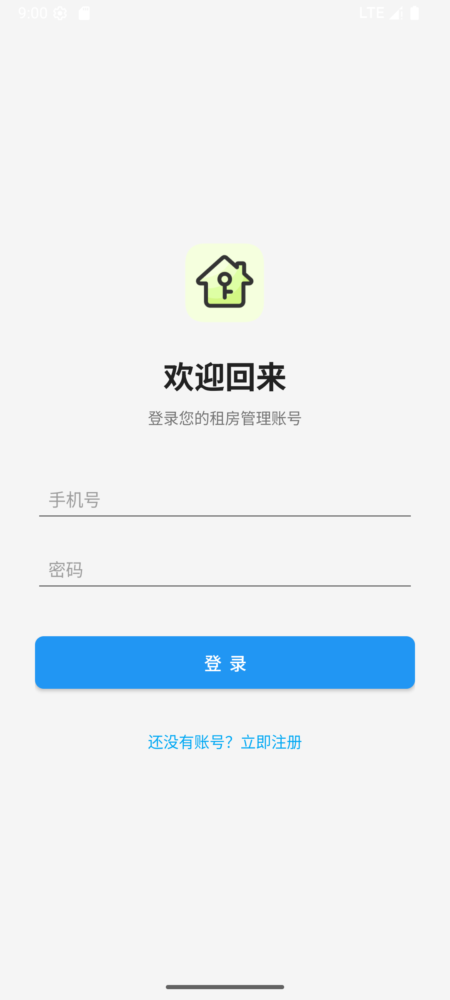
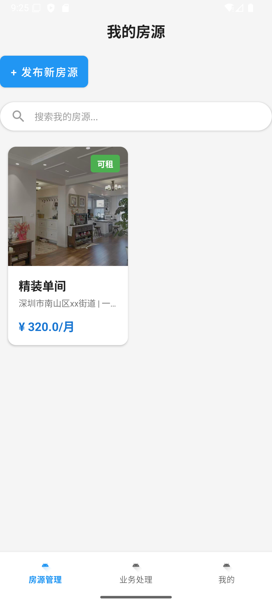
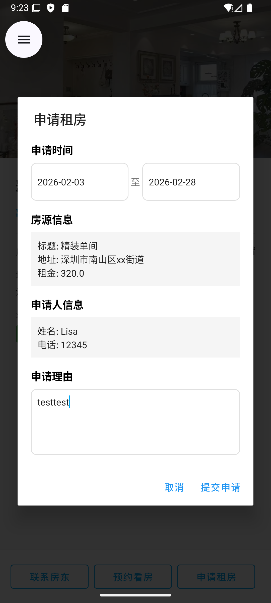
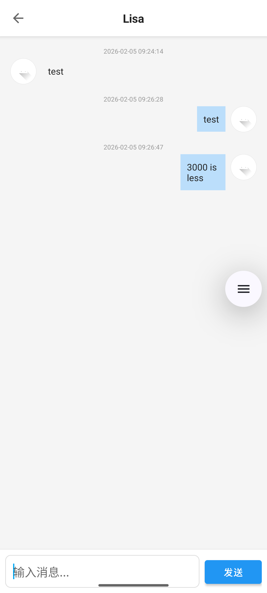
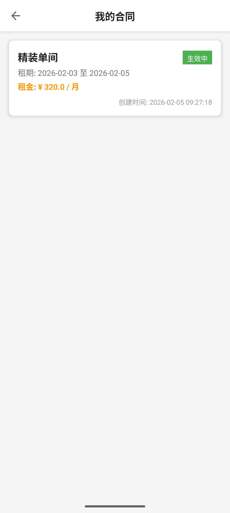

##  核心功能模块

### 1. 用户体系
- **角色区分**: 支持 **房东 (Landlord)** 和 **租客 (Tenant)** 两种角色。
- **功能**: 注册、登录、个人信息编辑。

### 2. 房源管理
- **房东**: 发布房源 、管理房源。
- **租客**: 浏览房源列表、查看房源详情。

### 3. 租赁流程
- **看房预约**: 租客发起预约，房东管理预约。
- **租赁申请**: 租客发起申请，房东审核 。
- **合同签署**: 申请通过后生成合同，双方可查看 。

### 4. 消息与沟通
- **实时聊天**: 房东与租客之间的一对一聊天。
- **消息中心**: 集中管理聊天记录。

### 5. 房屋公告
- 房东可发布的通知公告。

##  部分应用截图

  
    
  
  
  
  

##  技术栈

*   **开发语言**: Java
*   **UI 框架**: 安卓原生框架
*   **构建工具**: Hvigor
*   **数据库**:SQLite

本项目仅供学习和演示使用。
